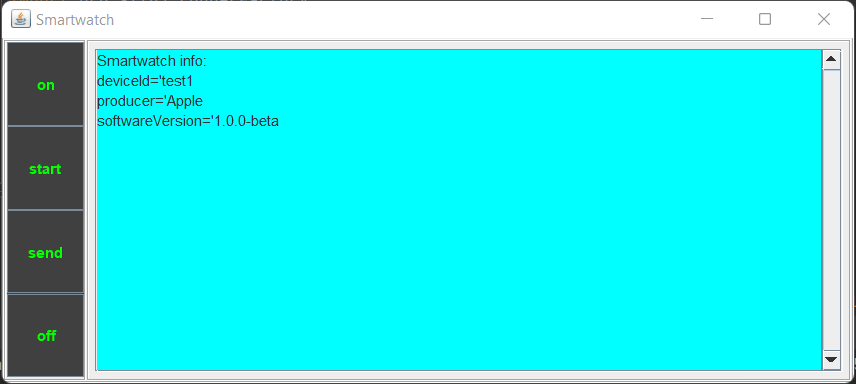

# Smartwatch
> The project aims to simulate a smartwatch in the role of publisher within the pub-sub paradigm using MQTT.
> The simple GUI allows to trigger all the functions of the core SmartWatch class, like connecting, measuring and publishing data.
> Fundamental is the presence and the coordination with an MQTT subscriber in order to make the application run properly.

## Table of Contents
* [General Info](#general-information)
* [Technologies Used](#technologies-used)
* [Screenshots](#screenshots)
* [Setup](#setup)
* [Usage](#usage)
* [Project Status](#project-status)
* [Room for Improvement](#room-for-improvement)
* [Acknowledgements](#acknowledgements)
* [Contact](#contact)
<!-- * [License](#license) -->

## General Information
- The maven project contains all the software needed to simulate the scenario. But during the presentation, I and my team's mate Christopher Zanoli are going to use his project as MQTT subscriber. 
- The project intends to provide a standard approach on how to synchronize the message flow between publisher and subscriber as well as showing how to use the MQTT's Paho framework in a simple way.
- The purpose of the project is to prototype a medical environment where a smartwatch is responsible for measuring the data from the patient.

## Technologies Used
- Java - version 1.8
- Paho - version 1.2.1
- Gson - version 2.8.6
- Logback - version 1.0.13

## Screenshots

## Setup
Clone the repo from my GitHub
https://github.com/jackma-00/IoTProject.git and open it as a IntelliJ project.

_Note you need valid and effective credentials in order to use the cloud broker. Here in the repo's code credentials are ineffective for privacy reasons._

## Usage
#### Simplest way
First run SmartWatchProcess (on the process package) and then MqttHandlerProcess (on the serverside package).
#### Fully potential 
Run SmartWatchProcessGUI (on the process package), simultaneously run the subscriber process on Chris's machine.
Then keep caution about the following coordination step:
1. Press the button 'on'.
2. Press the button 'start'.
3. Make a post request on Chris's server.
4. Press the button 'send' to measure and send the results to Chris.
5. At this point you can either start a new cycle of measurements going back to the point 2. or press the button 'off' to disconnect the client and turn off the device.

## Project Status
Project is _complete_ for the exam's presentation.

## Room for Improvement

Room for improvement:
- Improve the GUI
- Improve the process of synchronization between publisher and subscriber
- support a local broker installed within the LAN

## Acknowledgements

- This project was inspired by the ideas of both me and Christopher Zanoli.
- This project was based on Marco Picone's lectures (Ph.D. - picone.m@gmail.com).
- Many thanks to Christopher Zanoli (270765@studenti.unimore.it) to collaborate with me on the writing of the codebase.

## Contact
Created by Jacopo Maragna (271504@studenti.unimore.it) - feel free to contact me!

